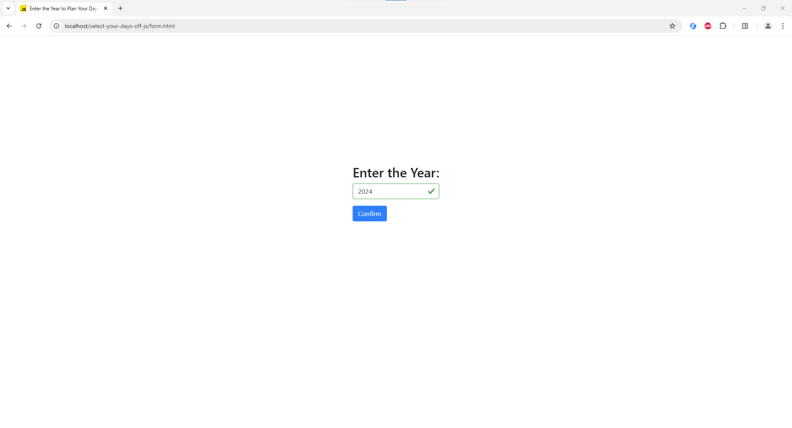
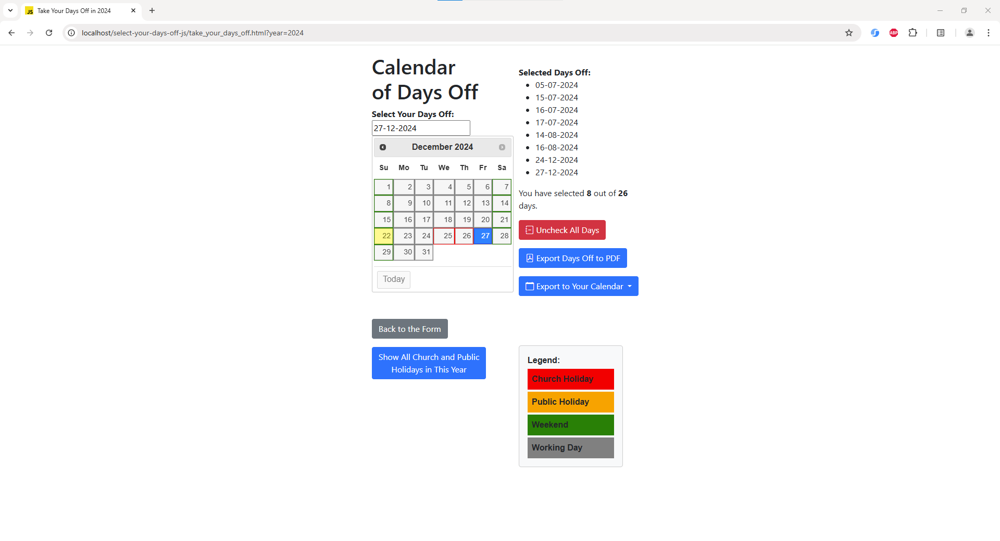
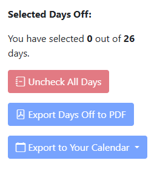
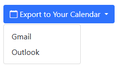
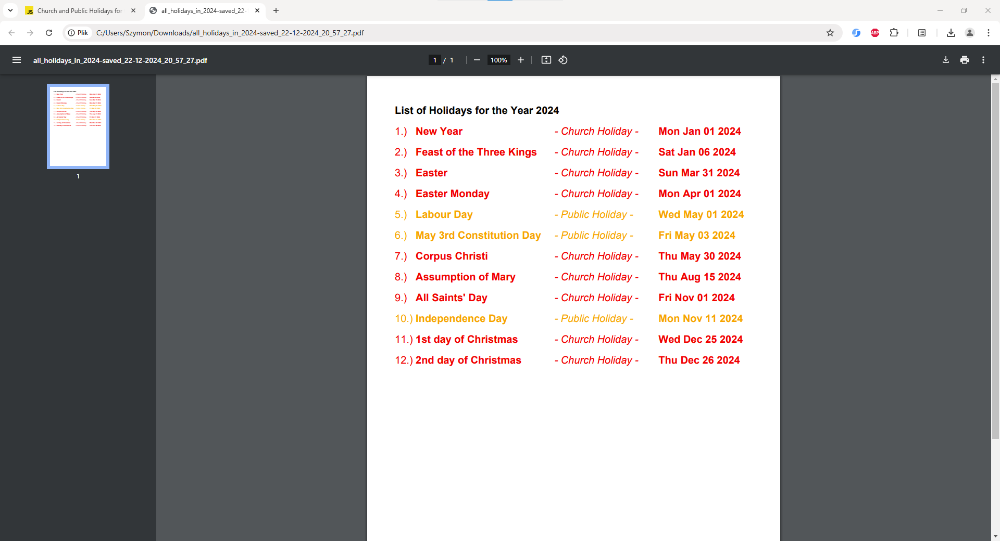

# Select Your Days Off (JS) 

A web application for selecting and exporting days off using JavaScript, jQuery, jQuery UI, jsPDF, and moment.js.

## Table of Contents

- [Overview](#overview)
- [Features](#features)
- [Installation](#installation)
- [How to Use](#how-to-use)
- [Dependencies and Data](#dependencies-and-data)

## Overview

This project provides a user-friendly web interface for selecting days off, visualizing them in a date picker, and exporting the selected days to a PDF file. It also supports exporting selected days in iCalendar format for Gmail and Outlook calendars.

## Features

- **Dynamic form validation:** Ensures the entered year is a valid integer within a dynamically set range (current year ± 5). Real-time error messages guide the user to correct the input before submission.
- **Interactive date picker:** The user can select days off with a clear and responsive date picker.
- **Highlighting holidays:** Public holidays are highlighted in orange frames, church holidays in red frames, weekends in green, and working days in grey within the date picker calendar.
- **Holiday protection:** Days that are church or public holidays in Poland cannot be selected as days off. An alert notifies the user if an attempt is made to select such dates.
- **Tooltip with holiday details:** When hovering over a holiday, the tooltip dynamically displays its name and type (e.g., Church or Public Holiday).
- **Export selected days to multiple formats:** Selected days can be exported to a PDF file or an iCalendar (.ics) file for Gmail and Outlook calendars.
- **Export of all holidays:** A complete list of church and public holidays for the selected year can be exported to a PDF file.
- **Responsive design:** Built with Twitter Bootstrap for a modern, mobile-friendly experience.
   
## Installation

1. Clone the repository.

   Open your terminal and run the following command to clone the repository:

    ```bash
    git clone https://github.com/Szymon-Wojtowicz/select-your-days-off-js.git
    ```
   
2. Open the application.

   Open `form.html` in your preferred web browser to start using the application.

## How to Use

1. **Open the app and enter a year into the form:**

   Open `form.html` in your web browser. Enter a year within the range of the current year ± 5 into the form. The range is dynamically adjusted based on the current year.
   
   
   
2. **See public and church holidays for the selected year:**

   The app displays all public and church holidays in the selected year in Poland. These are marked in a different color. 
   
   The days with public holidays are highlighted in orange frames, and the days with church holidays are highlighted in red frames. 
   
   Working days are highlighted in grey frames. Weekend days are in green frames. 

   

3. **See holiday details on hover:**

   When you hover the mouse cursor over a day in the calendar that is a public or church holiday, a dynamic tooltip will appear next to the cursor. The tooltip displays the holiday's name and type, updating dynamically based on the day you hover over.

   - **Public holidays**: The tooltip displays the name of the holiday and marks it as a **Public Holiday**.
   - **Church holidays**: The tooltip displays the name of the holiday and marks it as a **Church Holiday**.

   

4. **Select your days off:**

   Use the date picker to select your desired days off. Click on the dates to mark them as selected. You can select max 26 days (besides church and public holidays).
   
   The list of selected days off and the counter are updated in real-time. You can select and then unselect a given day.
   
   

5. **Unselect all your days off:**

   Use the `Uncheck All Days` button to unselect all days which you checked earlier. After clicking the `Uncheck All Days` button, the list of selected days off will be cleared, and the days off counter will be reset.
   
   
    
   

6. **Export all selected days off to PDF:**

   Once you have selected all your desired days off, use the `Export Days Off to PDF` button to generate a PDF file with the selected days.

   

   **Example PDF:**
   
   - [Download example: Export all selected days off to PDF](assets/your_days_off_in_2024-saved_28-06-2024_13_55_33.pdf)

7. **Export all selected days off to iCalendar:**

   Once you have selected all your desired days off, use the `Export to Your Calendar \ Gmail` and `Export to Your Calendar \ Outlook` buttons to generate iCalendar files (with your selected days) for Gmail and Outlook calendars.
   
   

   **Example iCalendar File:**
   
   - [Download example: Export all selected days off to iCalendar (.ics)](assets/gmail-your_days_off_in_2024-saved_28-06-2024_16_07_55.ics)

   You can import these files into your Google Calendar or Outlook Calendar to add your selected days off to your calendar.
   
8. **See complete list of church and public holidays for the selected year:**

   Use the `Show All Church and Public Holidays in This Year` button to see the complete list of church and public holidays for the selected year.
   
   
   
   **Example complete list of church and public holidays for the selected year:**
   

9. **Export the complete list of church and public holidays for the selected year to PDF:**

   Use the `Export to PDF: List of Holidays for This Year` button to generate a PDF file with the complete list of public and church holidays for the selected year.

   

   **Example PDF:**
   
   - [Download example: Export the complete list of church and public holidays for the selected year to PDF](assets/all_holidays_in_2024-saved_28-06-2024_16_47_57.pdf)
      
## Dependencies and Data

The project uses the following libraries and frameworks:
- [Twitter Bootstrap](https://getbootstrap.com/)
- [jQuery](https://jquery.com/)
- [jQuery UI](https://jqueryui.com/)
- [Moment.js](https://cdnjs.com/libraries/moment.js/2.29.1)
- [jsPDF](https://cdnjs.com/libraries/jspdf)
- [jsPDF-AutoTable](https://github.com/simonbengtsson/jsPDF-AutoTable)
- [iCalendar](https://github.com/nwcell/ics.js/)
- [FileSaver](https://cdnjs.com/libraries/FileSaver.js)

The `holidays` array in `app.js` dynamically generates and stores holiday dates for the year selected by the user, utilizing functions implemented in `calendar.js`.